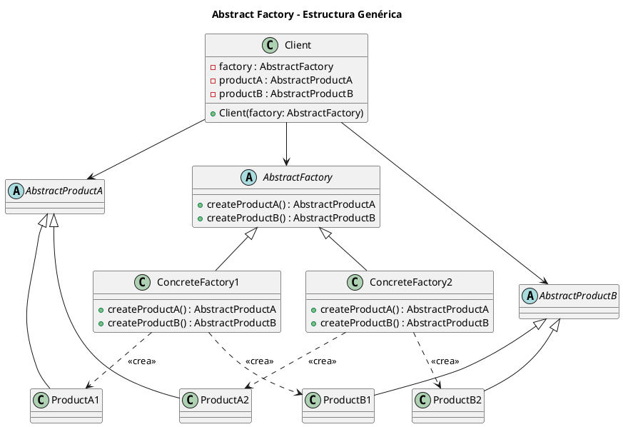
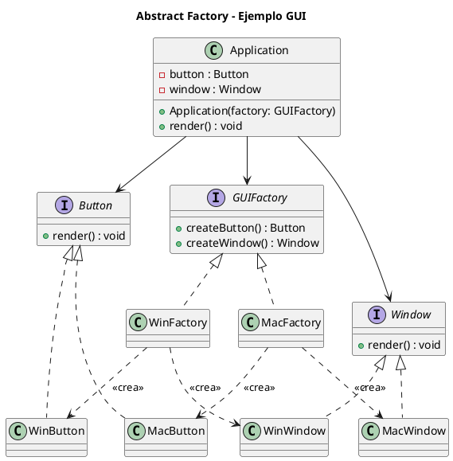

# abstract-factory.puml

A continuación el código en PlantUML para el diagrama de clases de Abstract Factory (puedes guardarlo como archivo `.puml` y renderizarlo con herramientas compatibles).

Si quieres el diagrama más específico del ejemplo GUI (con `GUIFactory`, `WinFactory`, etc.), aquí está:

Este diagrama refleja directamente la implementación Java y Python mostrada.

---

Si deseas que continúe con los siguientes archivos del patrón Builder o cualquier otro, házmelo saber.

<!-- Navigation Footer -->
---

| Anterior | Inicio | Siguiente |
| :--- | :---: | ---: |
| [◀ Abstract factory](../01-abstract-factory.md) | [🏠 Inicio](../../../index.md) | [Abstract factory java ▶](../ejemplos/02-abstract-factory-java.md) |
