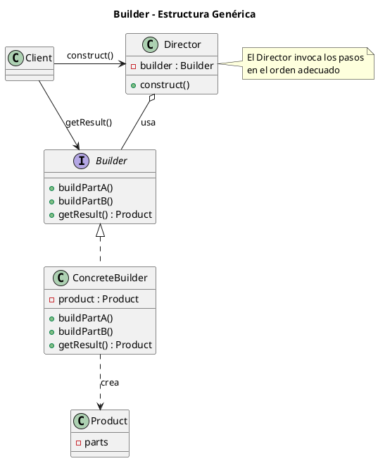
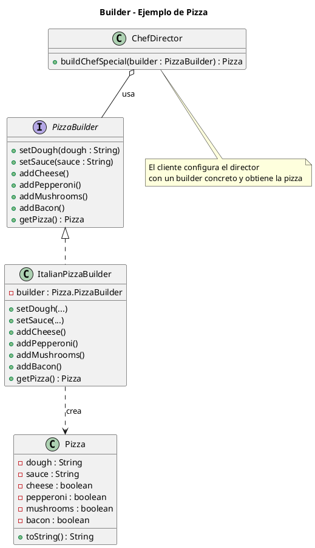

# builder.puml

## Diagrama genérico del patrón Builder (con Director)

## Diagrama del ejemplo concreto (pizza)

Guarda estos archivos en la estructura de carpetas indicada y se podrán visualizar fácilmente con cualquier renderizador PlantUML.

¿Continuamos con `factory-method`?

<!-- Navigation Footer -->
---

| Anterior | Inicio | Siguiente |
| :--- | :---: | ---: |
| [◀ Builder](../01-builder.md) | [🏠 Inicio](../../../index.md) | [Builder java ▶](../ejemplos/02-builder-java.md) |
