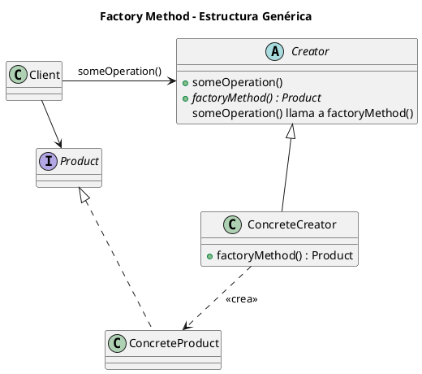
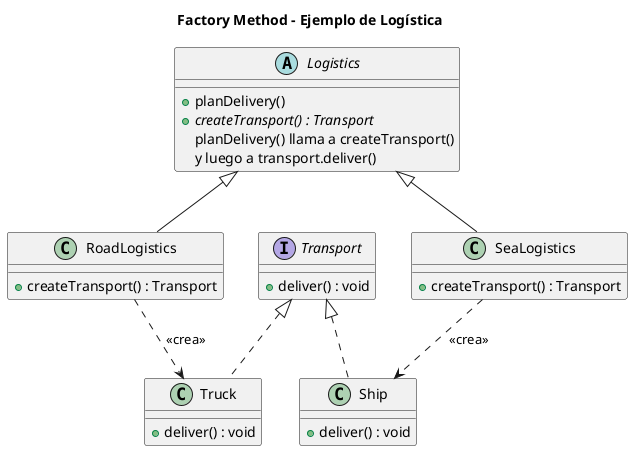

# factory-method.puml

## Diagrama genérico del patrón Factory Method

## Diagrama del ejemplo de logística

Este diagrama UML refleja exactamente el diseño implementado en los ejemplos Java y Python.

¿Proseguimos con **Prototype**?

<!-- Navigation Footer -->
---

| Anterior | Inicio | Siguiente |
| :--- | :---: | ---: |
| [◀ Factory method](../01-factory-method.md) | [🏠 Inicio](../../../index.md) | [Factory method java ▶](../ejemplos/02-factory-method-java.md) |
