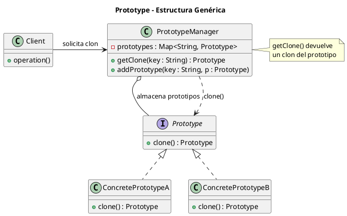
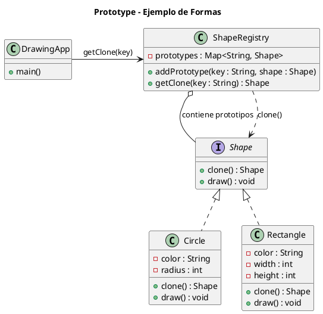

# prototype.puml

## Diagrama genérico del patrón Prototype

## Diagrama del ejemplo de formas gráficas

¿Continuamos con **Singleton**, el último patrón creacional?

<!-- Navigation Footer -->
---

| Anterior | Inicio | Siguiente |
| :--- | :---: | ---: |
| [◀ Prototype](../01-prototype.md) | [🏠 Inicio](../../../index.md) | [Prototype java ▶](../ejemplos/02-prototype-java.md) |
