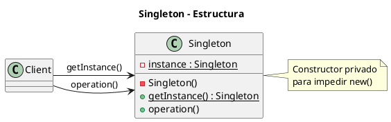
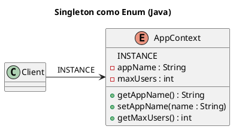

# singleton.puml

El diagrama de clases para Singleton es el más simple de todos.

Si se desea incluir la variante Enum (Java):

Con esto completamos el contenido detallado del patrón Singleton. ¿Pasamos ahora a los patrones estructurales con **Adapter**?

<!-- Navigation Footer -->
---

| Anterior | Inicio | Siguiente |
| :--- | :---: | ---: |
| [◀ Singleton](../01-singleton.md) | [🏠 Inicio](../../../index.md) | [Singleton java ▶](../ejemplos/02-singleton-java.md) |
