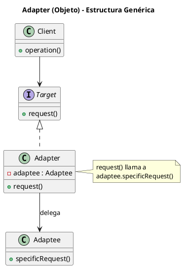
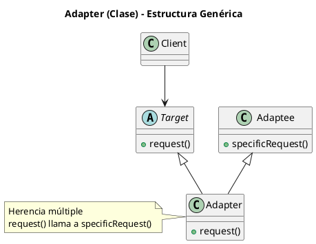
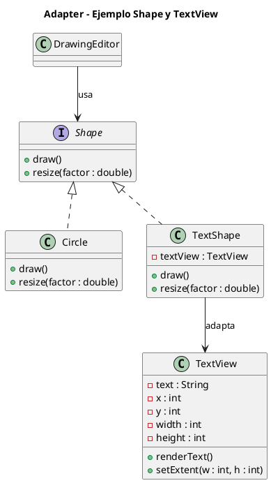

# adapter.puml

## Diagrama genérico de Adapter (de objeto)

## Diagrama genérico de Adapter (de clase)

## Diagrama del ejemplo concreto (Shape y TextView)

He conservado la referencia al cliente (`DrawingEditor`) que usa la interfaz `Shape`.

Con esto queda cubierto el patrón Adapter en profundidad. ¿Continuamos con el siguiente estructural, **Bridge**?

<!-- Navigation Footer -->
---

| Anterior | Inicio | Siguiente |
| :--- | :---: | ---: |
| [◀ Adapter](../01-adapter.md) | [🏠 Inicio](../../../index.md) | [Adapter java ▶](../ejemplos/02-adapter-java.md) |
