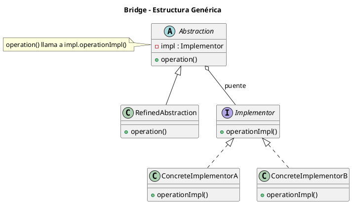
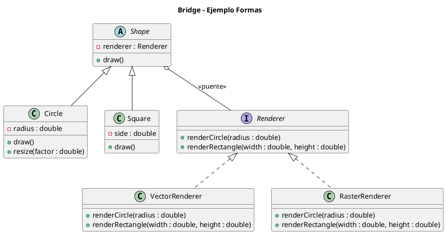

# bridge.puml

## Diagrama genérico del patrón Bridge

## Diagrama del ejemplo Formas y Renderizadores

¿Seguimos con **Composite**?

<!-- Navigation Footer -->
---

| Anterior | Inicio | Siguiente |
| :--- | :---: | ---: |
| [◀ Bridge](../01-bridge.md) | [🏠 Inicio](../../../index.md) | [Bridge java ▶](../ejemplos/02-bridge-java.md) |
