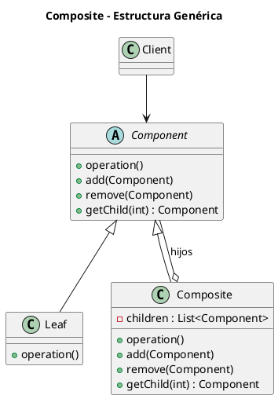
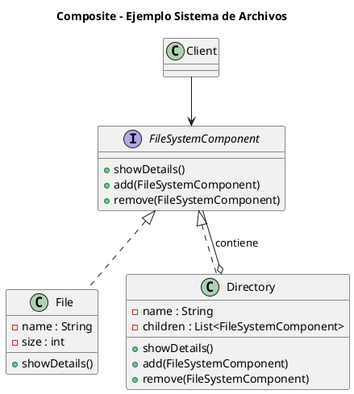

# composite.puml

## Diagrama genérico del patrón Composite

## Diagrama del ejemplo de sistema de archivos

¿Continuamos con **Decorator**?

<!-- Navigation Footer -->
---

| Anterior | Inicio | Siguiente |
| :--- | :---: | ---: |
| [◀ Composite](../01-composite.md) | [🏠 Inicio](../../../index.md) | [Composite java ▶](../ejemplos/02-composite-java.md) |
