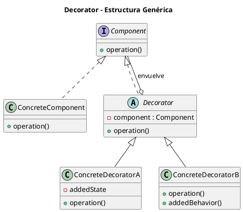
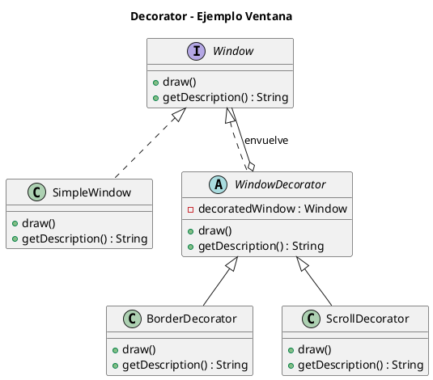

# decorator.puml

## Diagrama genérico del patrón Decorator

## Diagrama del ejemplo de ventanas

¿Continuamos con **Facade**?

<!-- Navigation Footer -->
---

| Anterior | Inicio | Siguiente |
| :--- | :---: | ---: |
| [◀ Decorator](../01-decorator.md) | [🏠 Inicio](../../../index.md) | [Decorator java ▶](../ejemplos/02-decorator-java.md) |
