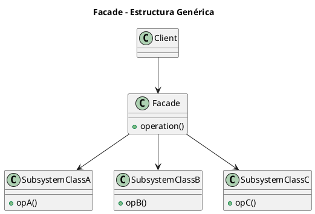
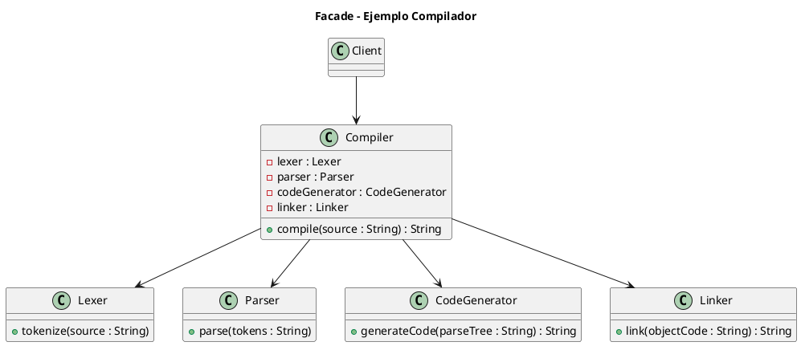

# facade.puml

## Diagrama genérico del patrón Facade

## Diagrama del ejemplo del compilador

¿Pasamos ahora a **Flyweight**?

<!-- Navigation Footer -->
---

| Anterior | Inicio | Siguiente |
| :--- | :---: | ---: |
| [◀ Facade](../01-facade.md) | [🏠 Inicio](../../../index.md) | [Facade java ▶](../ejemplos/02-facade-java.md) |
