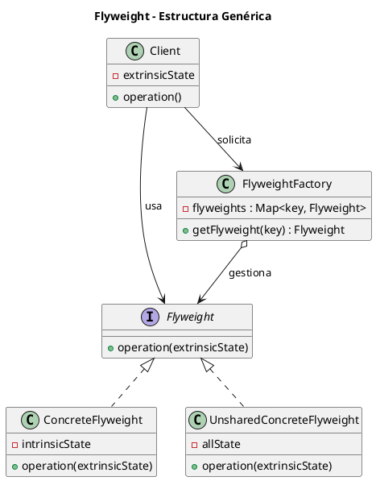
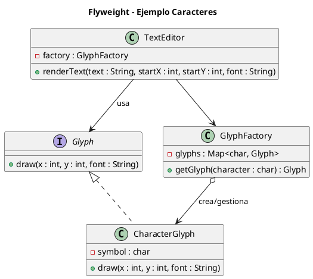

# flyweight.puml

## Diagrama genérico del patrón Flyweight

## Diagrama del ejemplo de caracteres

¿Avanzamos con el último estructural, **Proxy**?

<!-- Navigation Footer -->
---

| Anterior | Inicio | Siguiente |
| :--- | :---: | ---: |
| [◀ Flyweight](../01-flyweight.md) | [🏠 Inicio](../../../index.md) | [Flyweight java ▶](../ejemplos/02-flyweight-java.md) |
