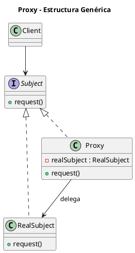
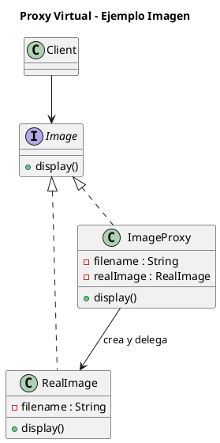
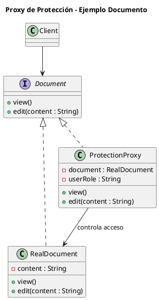

# proxy.puml

## Diagrama genérico del patrón Proxy

## Diagrama del ejemplo de proxy virtual (imagen)

## Diagrama del ejemplo de proxy de protección (documento)

Con esto completamos el contenido detallado del patrón Proxy y, a su vez, todos los patrones estructurales. ¿Quieres que continuemos con los patrones de comportamiento, empezando por **Chain of Responsibility**?

<!-- Navigation Footer -->
---

| Anterior | Inicio | Siguiente |
| :--- | :---: | ---: |
| [◀ Proxy](../01-proxy.md) | [🏠 Inicio](../../../index.md) | [Proxy java ▶](../ejemplos/02-proxy-java.md) |
