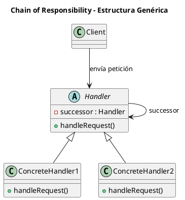
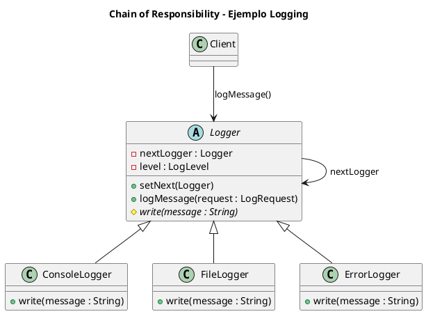

# chain-of-responsibility.puml

## Diagrama genérico del patrón

## Diagrama del ejemplo de logging

¿Continuamos con **Command**?

<!-- Navigation Footer -->
---

| Anterior | Inicio | Siguiente |
| :--- | :---: | ---: |
| [◀ Chain of responsibility](../01-chain-of-responsibility.md) | [🏠 Inicio](../../../index.md) | [Chain of responsibility java ▶](../ejemplos/02-chain-of-responsibility-java.md) |
