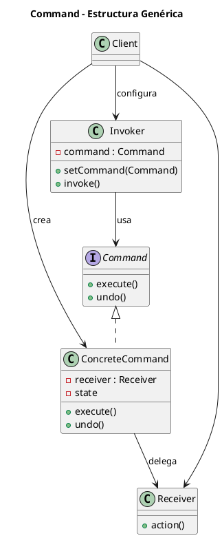
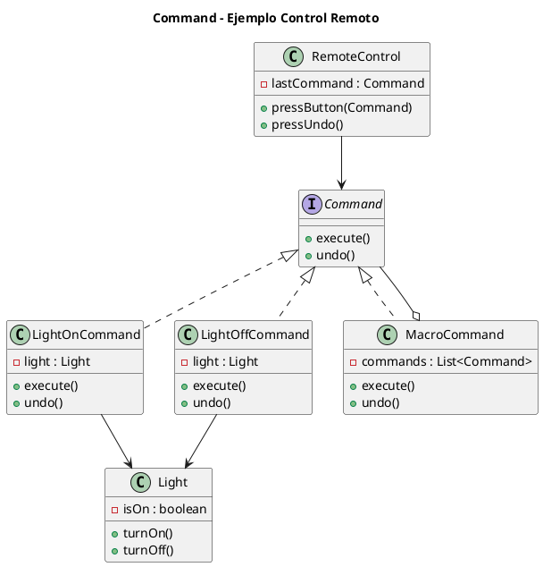

# command.puml

## Diagrama genérico del patrón Command

## Diagrama del ejemplo del control remoto

¿Continuamos con **Interpreter**?

<!-- Navigation Footer -->
---

| Anterior | Inicio | Siguiente |
| :--- | :---: | ---: |
| [◀ Command](../01-command.md) | [🏠 Inicio](../../../index.md) | [Command java ▶](../ejemplos/02-command-java.md) |
