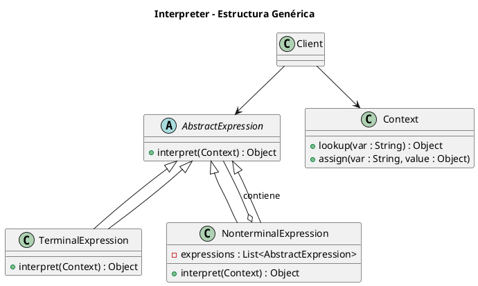
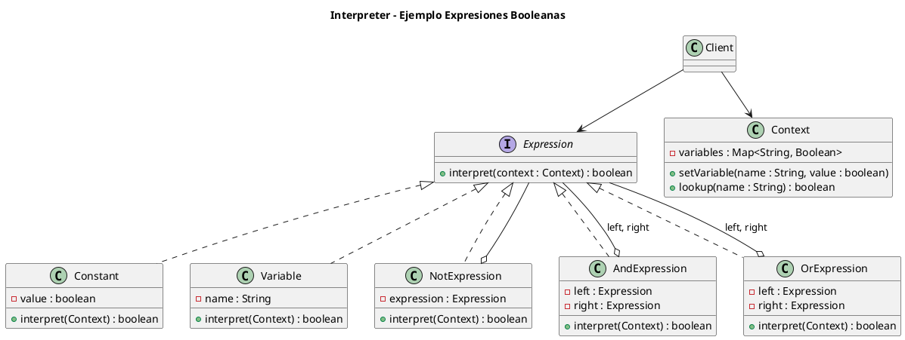

# interpreter.puml

## Diagrama genérico del patrón Interpreter

## Diagrama del ejemplo de expresiones booleanas

¿Seguimos con **Iterator**?

<!-- Navigation Footer -->
---

| Anterior | Inicio | Siguiente |
| :--- | :---: | ---: |
| [◀ Interpreter](../01-interpreter.md) | [🏠 Inicio](../../../index.md) | [Interpreter java ▶](../ejemplos/02-interpreter-java.md) |
