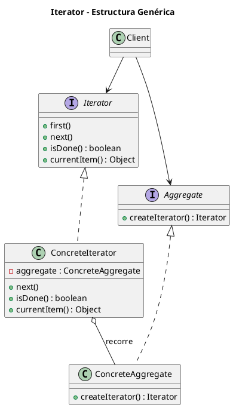
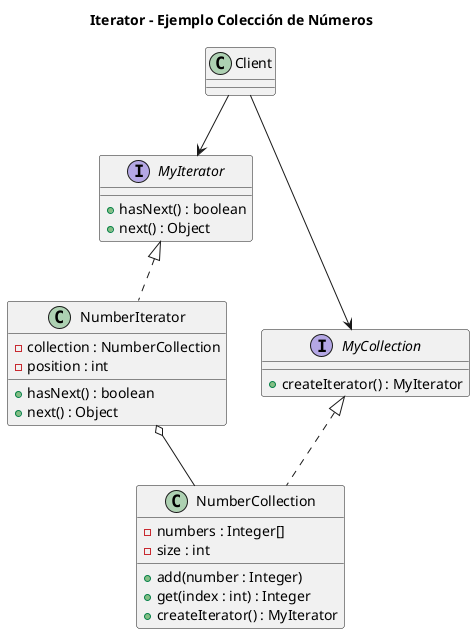

# iterator.puml

## Diagrama genérico del patrón Iterator

## Diagrama del ejemplo de colección de números

¿Proseguimos con **Mediator**?

<!-- Navigation Footer -->
---

| Anterior | Inicio | Siguiente |
| :--- | :---: | ---: |
| [◀ Iterator](../01-iterator.md) | [🏠 Inicio](../../../index.md) | [Iterator java ▶](../ejemplos/02-iterator-java.md) |
