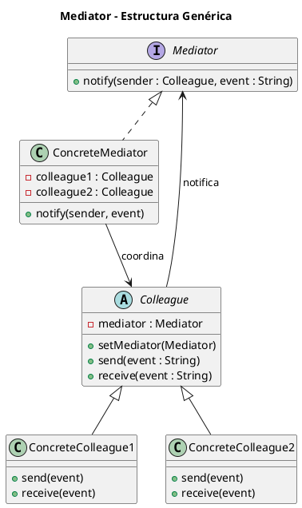
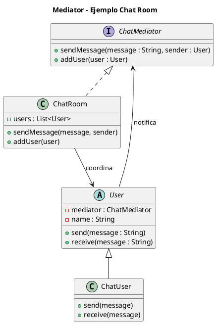

# mediator.puml

## Diagrama genérico del patrón Mediator

## Diagrama del ejemplo del chat

¿Continuamos con **Memento**?

<!-- Navigation Footer -->
---

| Anterior | Inicio | Siguiente |
| :--- | :---: | ---: |
| [◀ Mediator](../01-mediator.md) | [🏠 Inicio](../../../index.md) | [Mediator java ▶](../ejemplos/02-mediator-java.md) |
