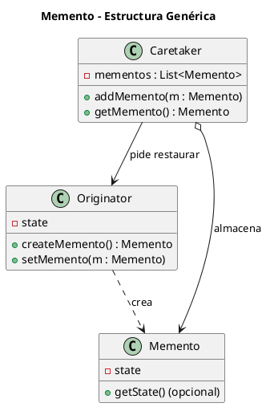
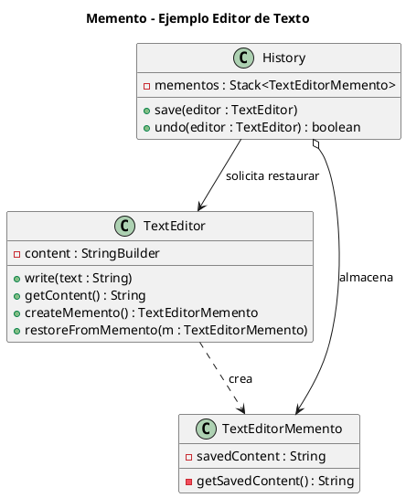

# memento.puml

## Diagrama genérico del patrón Memento

## Diagrama del ejemplo del editor de texto

¿Pasamos a **Observer**?

<!-- Navigation Footer -->
---

| Anterior | Inicio | Siguiente |
| :--- | :---: | ---: |
| [◀ Memento](../01-memento.md) | [🏠 Inicio](../../../index.md) | [Memento java ▶](../ejemplos/02-memento-java.md) |
