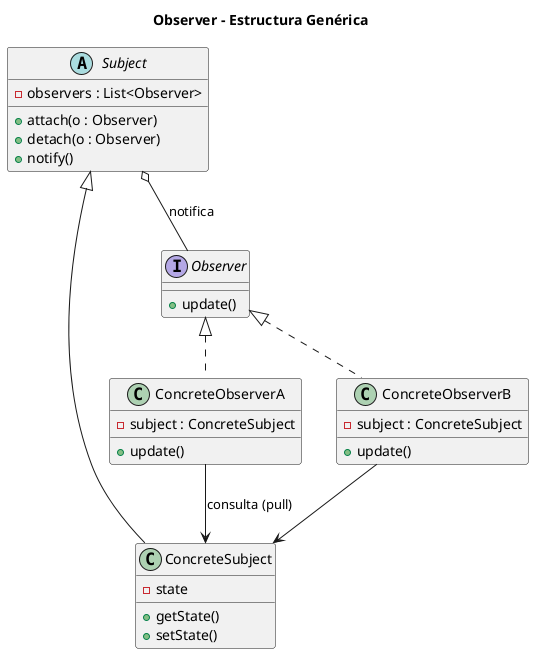
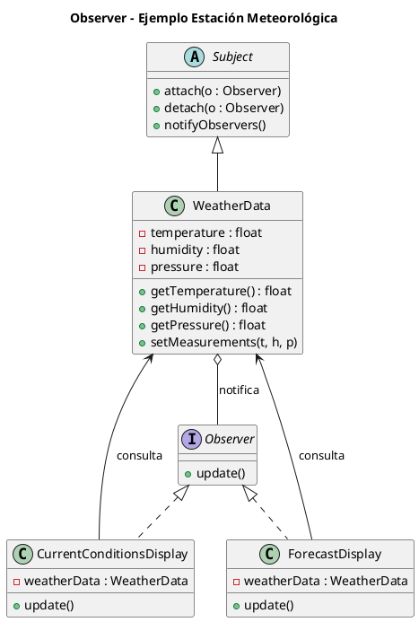

# observer.puml

## Diagrama genérico del patrón Observer

## Diagrama del ejemplo de la estación meteorológica

¿Continuamos con **State**?

<!-- Navigation Footer -->
---

| Anterior | Inicio | Siguiente |
| :--- | :---: | ---: |
| [◀ Observer](../01-observer.md) | [🏠 Inicio](../../../index.md) | [Observer java ▶](../ejemplos/02-observer-java.md) |
