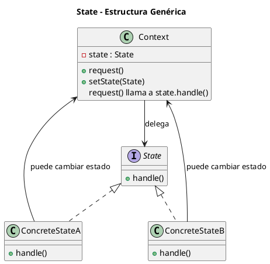
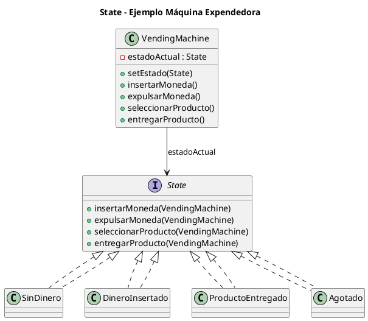

# state.puml

## Diagrama genérico del patrón State

## Diagrama del ejemplo de la máquina expendedora

¿Continuamos con **Strategy**?

<!-- Navigation Footer -->
---

| Anterior | Inicio | Siguiente |
| :--- | :---: | ---: |
| [◀ State](../01-state.md) | [🏠 Inicio](../../../index.md) | [State java ▶](../ejemplos/02-state-java.md) |
