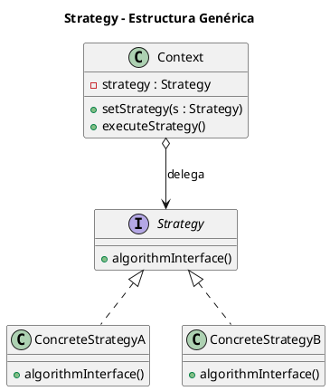
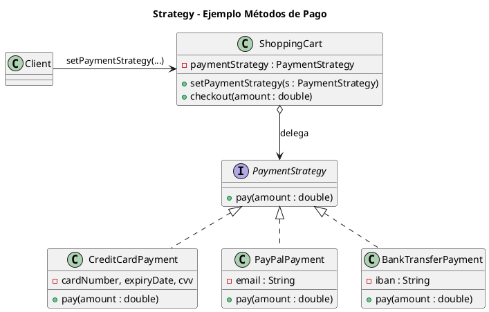

# strategy.puml

## Diagrama genérico del patrón Strategy

## Diagrama del ejemplo de pagos

¿Pasamos al siguiente: **Template Method**?

<!-- Navigation Footer -->
---

| Anterior | Inicio | Siguiente |
| :--- | :---: | ---: |
| [◀ Strategy](../01-strategy.md) | [🏠 Inicio](../../../index.md) | [Strategy java ▶](../ejemplos/02-strategy-java.md) |
