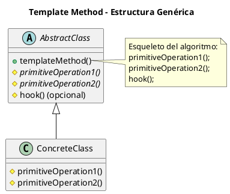
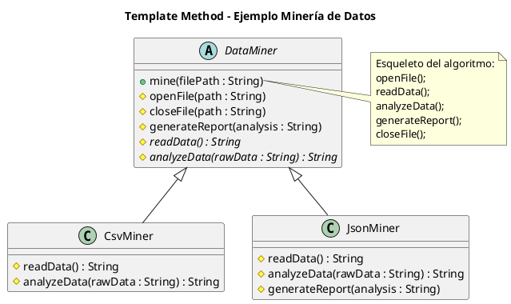

# template-method.puml

## Diagrama genérico del patrón Template Method

## Diagrama del ejemplo de minería de datos

Queda solo un patrón: ¿vamos con **Visitor**, el último de los 23?

<!-- Navigation Footer -->
---

| Anterior | Inicio | Siguiente |
| :--- | :---: | ---: |
| [◀ Template method](../01-template-method.md) | [🏠 Inicio](../../../index.md) | [Template method java ▶](../ejemplos/02-template-method-java.md) |
