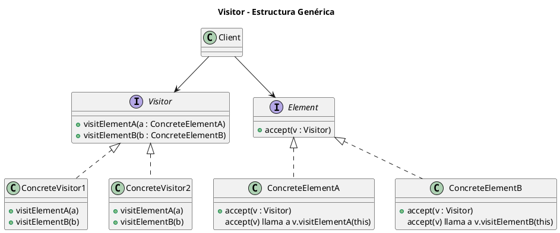
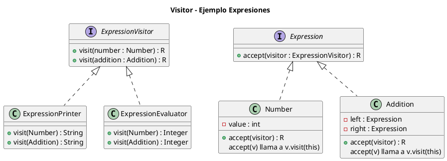

# visitor.puml

## Diagrama genérico del patrón Visitor

## Diagrama del ejemplo de expresiones aritméticas

Con esto se completan los 23 patrones GoF con el mismo nivel de profundidad y extensión.

<!-- Navigation Footer -->
---

| Anterior | Inicio | Siguiente |
| :--- | :---: | ---: |
| [◀ Visitor](../01-visitor.md) | [🏠 Inicio](../../../index.md) | [Visitor java ▶](../ejemplos/02-visitor-java.md) |
